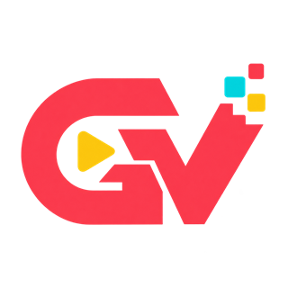

# GameVitto



GameVitto é uma central de jogos criada por [VitorCGO](https://github.com/vitorcgo). A proposta é reunir experiências para navegador em uma interface única, simples de iniciar e agradável para jogar na tela grande.

O primeiro jogo disponível é o **Mario Kart**, com oito pilotos, adversários controlados pelo jogo, itens, derrapagem, antigravidade e planador.

## Como iniciar

Requisitos: Node.js 22 ou mais recente e OpenSSL disponível no sistema.

```sh
npm ci
npm run dev
```

Abra o endereço principal mostrado no terminal e escolha um jogo. O Mario Kart também oferece um controle remoto acessado pelo código QR da tela. Na primeira conexão, pode ser necessário aceitar o certificado local para liberar os sensores de movimento.

O servidor escolhe automaticamente um endereço da rede local. Se necessário, defina `GAMEVITTO_IP` durante a execução para escolher manualmente outro endereço IPv4. Essa configuração não é gravada no projeto.

## Mario Kart

O jogo pode ser controlado pelo teclado ou pelo controle remoto aberto no celular.

| Ação | Celular | Teclado |
| --- | --- | --- |
| Virar | Inclinar para os lados | ← e → |
| Acelerar | Segurar **2** | **Z** |
| Frear ou dar ré | Segurar **1** | **X** |
| Derrapar | Segurar **A** ao virar | **Shift** |
| Usar item | Direcional para a direita | **Espaço** |
| Confirmar | **2** | **Enter** |
| Recalibrar | **−** | **R** |
| Pausar | — | **Esc** |

## Verificação

Os testes abaixo não abrem navegador:

```sh
npm run test:unit
```

## Privacidade

O GameVitto funciona na rede local e não possui telemetria. Certificados, arquivos `.env`, pacotes de recursos opcionais e resultados de revisão permanecem ignorados pelo Git.

## Licença e créditos

O código do projeto está sob a licença MIT. Mario Kart e seus personagens são marcas e propriedades da Nintendo; este é um projeto independente feito por fãs, sem vínculo oficial.

Algumas artes promocionais de itens pertencentes à Nintendo estão incluídas e não fazem parte da licença MIT. As origens estão registradas em [Fontes das artes dos itens](games/mario-kart/item-art/SOURCES.md). A textura original do gramado tem sua procedência descrita em [Textura original do gramado](games/mario-kart/art/README.md). Ferramentas para recursos locais opcionais são documentadas em [Conversões locais opcionais](games/mario-kart/pipeline/SOURCE-ASSETS.md).

A marca do GameVitto e a arte de kart usadas na central foram geradas originalmente para este projeto com a ferramenta integrada de geração de imagens, sem imagens de referência protegidas, personagens, marcas ou logotipos de terceiros.
